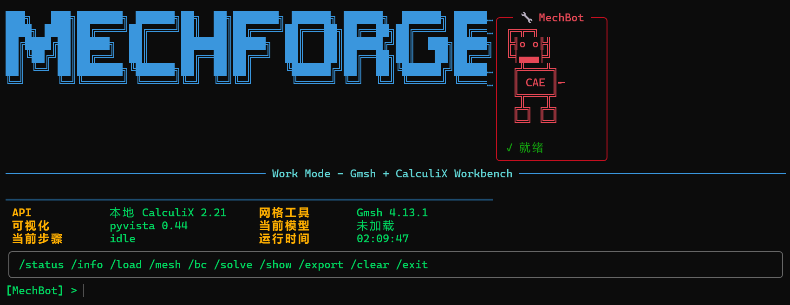

# MechForge

**机械设计师的本地 AI 工作台** —— 终于有一款**真正懂机械、敢说真话、能真算**的工具

## 界面预览

### AI 对话模式


### 知识库检索模式


### CAE 工作台模式



---

## 为什么机械设计师需要 MechForge？

每天你都在和通用大模型斗智斗勇：
它一会儿胡说八道安全系数，一会儿给你云端泄露图纸跑一次有限元，一会儿又无法真正。

**MechForge 彻底解决这三个痛点**：

### 1. 绝对可信 —— 知识查阅模式"只搬书，不编故事"
- 纯检索 + 原文呈现，AI 绝不允许自由生成
- 查询 GB/JB 手册、零件参数、标准条款时，直接弹出原文 + 出处
- 工程师最怕的"幻觉"在这里被彻底封杀

### 2. 像老工程师一样聊天 —— AI 模式
- 不是一本会说话的手册，而是一位有 10+ 年经验的机械前辈
- 会问工况、提醒裕度、对比选型、指出加工风险
- 支持 /rag 临时调用知识库，聊天与查书无缝切换

### 3. 真正能干活 —— Work 模式 (CAE 工作台)
- 本地网格划分：Gmsh 集成
- 有限元求解：CalculiX 集成
- 结果可视化：PyVista 支持
- 完整 CAE 工作流：加载几何 → 网格 → 边界条件 → 求解 → 后处理

---

## 三大模式

| 模式 | 命令 | 功能 |
|------|------|------|
| AI 对话 | `mechforge-ai` | 智能问答、设计建议 |
| 知识库 | `mechforge-k` | 纯原文检索、不许 AI 编造 |
| CAE 工作台 | `mechforge-work` | 网格划分、有限元求解 |

---

## 安装方式

### 方式一：从 GitHub 安装

```bash
# 安装最新版本
pip install git+https://github.com/yd5768365-hue/mechforge.git
```

### 方式二：克隆后安装

```bash
# 克隆仓库
git clone https://github.com/yd5768365-hue/mechforge.git
cd mechforge

# 安装依赖
pip install -e .

# 启动三大模式
mechforge-ai      # AI 对话模式
mechforge-k       # 知识库检索模式
mechforge-work    # CAE 工作台模式
```

### 方式三：便携版 (无需安装)

```bash
# 直接运行 Python 脚本
python run_main.py      # AI 对话模式
python run_knowledge.py # 知识库检索模式
python run_work.py      # CAE 工作台模式
```

---

## CAE 工作台命令

```
/load <文件>   加载几何文件 (STEP/IGES/STL)
/mesh [选项]   生成网格 (--size=5 --type=tet)
/bc            设置边界条件
/solve [类型]  求解 (static/thermal/modal)
/show [类型]   显示结果 (vonmises/displacement)
/export <格式> 导出 (vtk/frd/pdf)
/status        显示状态
/help          查看帮助
/exit          退出
```

---

## 配置

编辑 `config.yaml` 或设置环境变量:

- `OPENAI_API_KEY` - OpenAI API Key
- `ANTHROPIC_API_KEY` - Anthropic API Key
- `OLLAMA_URL` - Ollama 服务地址 (默认 http://localhost:11434)
- `OLLAMA_MODEL` - Ollama 模型名称

---

## 一句话总结

**MechForge 不是又一个 ChatGPT 包装，而是机械设计圈里第一个"本地、可信、能真干活"的 AI 工作台。**

---

## 版本

当前版本: v0.4.0
