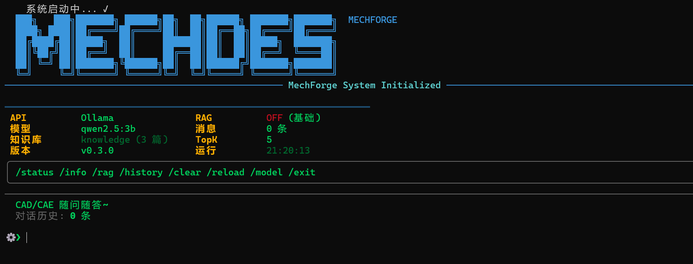
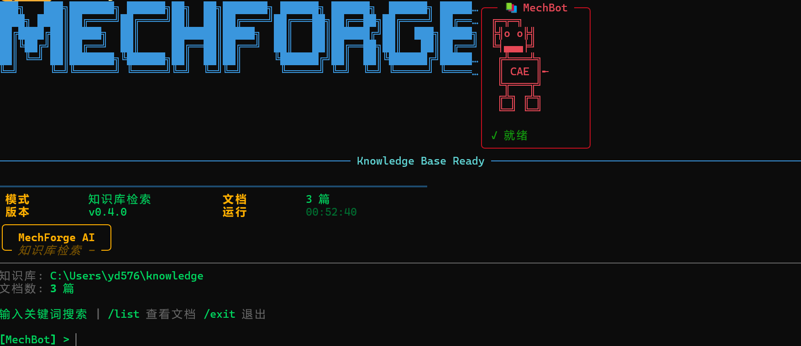

[index.html](https://github.com/user-attachments/files/25622644/index.html)[README.md](https://github.com/user-attachments/files/25621948/README.md)
# MechForge / MechChodes

**机械设计师的本地 AI 工作台** —— 终于有一款**真正懂机械、敢说真话、能真算**的工具

## 界面预览

### AI 对话模式



### 知识库检索模式

[Uploading index<!DOCTYPE html>
<html lang="zh-CN">
<head>
    <meta charset="UTF-8">
    <meta name="viewport" content="width=device-width, initial-scale=1.0">
    <title>MechForge | 机械设计师的本地 AI 工作台</title>
    <script src="https://cdn.tailwindcss.com"></script>
    <style>
        @import url('https://fonts.googleapis.com/css2?family=Fira+Code:wght@400;500;700&display=swap');

        body { background-color: #0b0f19; }
        .font-mono { font-family: 'Fira Code', monospace; }

        .glass-card {
            background: rgba(15, 23, 42, 0.7);
            backdrop-filter: blur(16px);
            border: 1px solid rgba(56, 189, 248, 0.15);
            box-shadow: 0 4px 30px rgba(0, 0, 0, 0.5);
        }

        .neon-glow {
            box-shadow: 0 0 20px rgba(56, 189, 248, 0.3);
        }

        .cursor-blink {
            animation: blink 1s step-end infinite;
        }
        @keyframes blink {
            0%, 100% { opacity: 1; }
            50% { opacity: 0; }
        }

        .tab-active {
            background: linear-gradient(180deg, rgba(56, 189, 248, 0.2) 0%, transparent 100%);
            border-bottom: 2px solid #22d3ee;
        }

        .ascii-art {
            white-space: pre;
            line-height: 1.1;
        }
    </style>
</head>
<body class="text-slate-200 font-sans antialiased selection:bg-cyan-900 selection:text-cyan-100">

    <nav class="border-b border-slate-800/50 bg-[#0b0f19]/80 sticky top-0 z-50 backdrop-blur-md">
        <div class="max-w-7xl mx-auto px-4 sm:px-6 lg:px-8 flex items-center justify-between h-16">
            <div class="flex items-center gap-2">
                <span class="text-2xl font-bold tracking-wider text-cyan-400">⚙ MECH<span class="text-white">FORGE</span></span>
            </div>
            <div class="hidden md:flex space-x-8 text-sm font-medium text-slate-400">
                <a href="#features" class="hover:text-cyan-400 transition-colors">核心优势</a>
                <a href="#terminal" class="hover:text-cyan-400 transition-colors">工作台展示</a>
                <a href="#modes" class="hover:text-cyan-400 transition-colors">三种模式</a>
                <a href="#install" class="hover:text-cyan-400 transition-colors">安装指南</a>
                <a href="https://github.com" target="_blank" class="hover:text-white transition-colors">GitHub ↗</a>
            </div>
        </div>
    </nav>

    <main class="mt-16 mx-auto max-w-7xl px-4 flex flex-col items-center text-center">
        <div class="inline-flex items-center gap-2 px-3 py-1 rounded-full bg-cyan-950/50 border border-cyan-800/50 text-cyan-300 text-xs font-mono mb-6">
            <span class="w-2 h-2 rounded-full bg-cyan-400 animate-pulse"></span>
            v0.4.0 - Monorepo 架构已发布
        </div>

        <!-- 顶部 ASCII Art -->
        <pre class="ascii-art text-[#1e90ff] font-bold text-[8px] sm:text-[10px] leading-none mb-6">
███╗   ███╗███████╗ ██████╗██╗  ██╗███████╗ ██████╗ ██████╗  ██████╗ ███████╗
████╗ ████║██╔════╝██╔════╝██║  ██║██╔════╝██╔═══██╗██╔══██╗██╔════╝ ██╔════╝
██╔████╔██║█████╗  ██║     ███████║█████╗  ██║   ██║██████╔╝██║  ███╗█████╗
██║╚██╔╝██║██╔══╝  ██║     ██╔══██║██╔══╝  ██║   ██║██╔══██╗██║   ██║██╔══╝
██║ ╚═╝ ██║███████╗╚██████╗██║  ██║██║     ╚██████╔╝██║  ██║╚██████╔╝███████╗
╚═╝     ╚═╝╚══════╝ ╚═════╝╚═╝  ╚═╝╚═╝      ╚═════╝ ╚═╝  ╚═╝ ╚═════╝ ╚══════╝
        </pre>

        <h1 class="text-4xl md:text-6xl font-extrabold tracking-tight mb-6">
            终于有一款<br/>
            <span class="text-transparent bg-clip-text bg-gradient-to-r from-cyan-400 via-blue-500 to-emerald-400">
                真正懂机械
            </span> 的工具
        </h1>
        <p class="mt-4 max-w-3xl text-lg text-slate-400 mb-10 leading-relaxed">
            告别通用大模型的"胡说八道"与数据泄露。<br/>
            MechForge 是机械设计圈里第一个 <strong>绝对本地、可信查阅、能跑仿真</strong> 的智能工作台。
        </p>

        <div class="flex flex-col sm:flex-row gap-4 w-full justify-center">
            <a href="#install" class="px-8 py-4 rounded-md text-white font-bold bg-cyan-600 hover:bg-cyan-500 neon-glow transition-all flex items-center justify-center gap-2">
                <svg class="w-5 h-5" fill="none" stroke="currentColor" viewBox="0 0 24 24"><path stroke-linecap="round" stroke-linejoin="round" stroke-width="2" d="M4 16v1a3 3 0 003 3h10a3 3 0 003-3v-1m-4-4l-4 4m0 0l-4-4m4 4V4"></path></svg>
                获取本地版本
            </a>
            <a href="#modes" class="px-8 py-4 rounded-md text-slate-300 font-bold bg-slate-800 border border-slate-700 hover:border-slate-500 transition-all flex items-center justify-center gap-2 font-mono">
                >_ 体验三形态界面
            </a>
        </div>
    </main>

    <!-- 三种模式切换展示 -->
    <section id="modes" class="mt-16 max-w-6xl mx-auto px-4">
        <div class="glass-card rounded-xl overflow-hidden shadow-2xl border border-slate-700">
            <!-- Tab 切换 -->
            <div class="bg-slate-900/80 px-4 flex items-center gap-1 border-b border-slate-800">
                <button onclick="switchTab('ai')" id="tab-ai" class="tab-active px-4 py-3 text-sm font-mono text-cyan-400 hover:text-white transition-colors">
                    🤖 AI 对话
                </button>
                <button onclick="switchTab('knowledge')" id="tab-knowledge" class="px-4 py-3 text-sm font-mono text-slate-400 hover:text-white transition-colors">
                    📚 知识库
                </button>
                <button onclick="switchTab('work')" id="tab-work" class="px-4 py-3 text-sm font-mono text-slate-400 hover:text-white transition-colors">
                    ⚙️ CAE 工作台
                </button>
            </div>

            <!-- AI 模式内容 -->
            <div id="content-ai" class="terminal-content p-4 sm:p-6 font-mono text-xs sm:text-sm leading-relaxed overflow-x-auto bg-[#0b0f19]">
                <pre class="ascii-art text-[#1e90ff] font-bold text-[6px] sm:text-[8px] leading-none mb-2">
███╗   ███╗███████╗ ██████╗██╗  ██╗███████╗ ██████╗ ██████╗  ██████╗ ███████╗
████╗ ████║██╔════╝██╔════╝██║  ██║██╔════╝██╔═══██╗██╔══██╗██╔════╝ ██╔════╝
██╔████╔██║█████╗  ██║     ███████║█████╗  ██║   ██║██████╔╝██║  ███╗█████╗
██║╚██╔╝██║██╔══╝  ██║     ██╔══██║██╔══╝  ██║   ██║██╔══██╗██║   ██║██╔══╝
██║ ╚═╝ ██║███████╗╚██████╗██║  ██║██║     ╚██████╔╝██║  ██║╚██████╔╝███████╗
╚═╝     ╚═╝╚══════╝ ╚═════╝╚═╝  ╚═╝╚═╝      ╚═════╝ ╚═╝  ╚═╝ ╚═════╝ ╚══════╝
                </pre>

                <div class="flex items-center text-cyan-500 mb-3 text-xs">
                    <div class="flex-grow border-t border-cyan-800"></div>
                    <span class="px-3 font-bold">MechForge System Initialized</span>
                    <div class="flex-grow border-t border-cyan-800"></div>
                </div>

                <div class="grid grid-cols-2 md:grid-cols-4 gap-y-1 gap-x-4 mb-4 w-max">
                    <div class="flex gap-2"><span class="text-orange-400 font-bold w-10">API</span><span class="text-green-400">Ollama</span></div>
                    <div class="flex gap-2"><span class="text-orange-400 font-bold w-10">RAG</span><span class="text-green-400 font-bold">ON</span></div>
                    <div class="flex gap-2"><span class="text-orange-400 font-bold w-10">模型</span><span class="text-cyan-400">qwen2.5</span></div>
                    <div class="flex gap-2"><span class="text-orange-400 font-bold w-10">消息</span><span class="text-cyan-400">5 条</span></div>
                </div>

                <div class="border border-slate-700 rounded p-2 mb-3 inline-block">
                    <span class="text-[#00ff7f] text-xs">/status /info /rag /history /clear /model /exit</span>
                </div>

                <div class="text-[#00ff7f] mb-1">机械之美，AI 来造 ~</div>
                <div class="text-slate-500 mb-4">对话历史: <span class="text-green-500">5</span> 条</div>

                <div class="flex items-center">
                    <span class="text-cyan-400 font-bold mr-2">⚙ ❯</span>
                    <span class="text-white">帮我查一下轴承 6205 的额定动载荷</span><span class="w-2 h-4 bg-cyan-400 ml-1 cursor-blink"></span>
                </div>
            </div>

            <!-- 知识库模式内容 -->
            <div id="content-knowledge" class="terminal-content hidden p-4 sm:p-6 font-mono text-xs sm:text-sm leading-relaxed overflow-x-auto bg-[#0b0f19]">
                <pre class="ascii-art text-[#1e90ff] font-bold text-[6px] sm:text-[8px] leading-none mb-2">
███╗   ███╗███████╗ ██████╗██╗  ██╗███████╗ ██████╗ ██████╗  ██████╗ ███████╗
████╗ ████║██╔════╝██╔════╝██║  ██║██╔════╝██╔═══██╗██╔══██╗██╔════╝ ██╔════╝
██╔████╔██║█████╗  ██║     ███████║█████╗  ██║   ██║██████╔╝██║  ███╗█████╗
██║╚██╔╝██║██╔══╝  ██║     ██╔══██║██╔══╝  ██║   ██║██╔══██╗██║   ██║██╔══╝
██║ ╚═╝ ██║███████╗╚██████╗██║  ██║██║     ╚██████╔╝██║  ██║╚██████╔╝███████╗
╚═╝     ╚═╝╚══════╝ ╚═════╝╚═╝  ╚═╝╚═╝      ╚═════╝ ╚═╝  ╚═╝ ╚═════╝ ╚══════╝
                </pre>

                <div class="flex items-center text-cyan-500 mb-3 text-xs">
                    <div class="flex-grow border-t border-cyan-800"></div>
                    <span class="px-3 font-bold">Knowledge Base Ready</span>
                    <div class="flex-grow border-t border-cyan-800"></div>
                </div>

                <div class="grid grid-cols-2 gap-2 mb-4 w-max">
                    <div class="flex gap-2"><span class="text-orange-400 font-bold w-10">模式</span><span class="text-green-400">知识库检索</span></div>
                    <div class="flex gap-2"><span class="text-orange-400 font-bold w-10">文档</span><span class="text-cyan-400">15 篇</span></div>
                </div>

                <div class="text-slate-400 mb-4">知识库: <span class="text-green-400">knowledge/</span> | 文档数: <span class="text-green-400">15 篇</span></div>

                <div class="flex items-center">
                    <span class="text-cyan-400 font-bold mr-2">⚙ ❯</span>
                    <span class="text-white">螺栓  GB/T 5782</span><span class="w-2 h-4 bg-cyan-400 ml-1 cursor-blink"></span>
                </div>

                <div class="mt-3 text-slate-500 text-xs">
                    <span class="text-yellow-500">输入关键词</span> <span class="text-slate-600">|</span> <span class="text-yellow-500">/list</span> <span class="text-slate-600">|</span> <span class="text-yellow-500">/exit</span>
                </div>
            </div>

            <!-- Work 模式内容 -->
            <div id="content-work" class="terminal-content hidden p-4 sm:p-6 font-mono text-xs sm:text-sm leading-relaxed overflow-x-auto bg-[#0b0f19]">
                <pre class="ascii-art text-[#1e90ff] font-bold text-[6px] sm:text-[8px] leading-none mb-2">
███╗   ███╗███████╗ ██████╗██╗  ██╗███████╗ ██████╗ ██████╗  ██████╗ ███████╗
████╗ ████║██╔════╝██╔════╝██║  ██║██╔════╝██╔═══██╗██╔══██╗██╔════╝ ██╔════╝
██╔████╔██║█████╗  ██║     ███████║█████╗  ██║   ██║██████╔╝██║  ███╗█████╗
██║╚██╔╝██║██╔══╝  ██║     ██╔══██║██╔══╝  ██║   ██║██╔══██╗██║   ██║██╔══╝
██║ ╚═╝ ██║███████╗╚██████╗██║  ██║██║     ╚██████╔╝██║  ██║╚██████╔╝███████╗
╚═╝     ╚═╝╚══════╝ ╚═════╝╚═╝  ╚═╝╚═╝      ╚═════╝ ╚═╝  ╚═╝ ╚═════╝ ╚══════╝
                </pre>

                <div class="flex items-center text-cyan-500 mb-3 text-xs">
                    <div class="flex-grow border-t border-cyan-800"></div>
                    <span class="px-3 font-bold">Work Mode - Gmsh + CalculiX</span>
                    <div class="flex-grow border-t border-cyan-800"></div>
                </div>

                <div class="grid grid-cols-2 md:grid-cols-4 gap-y-1 gap-x-4 mb-4 w-max">
                    <div class="flex gap-2"><span class="text-orange-400 font-bold w-10">API</span><span class="text-green-400">CalculiX</span></div>
                    <div class="flex gap-2"><span class="text-orange-400 font-bold w-10">网格</span><span class="text-green-400">Gmsh</span></div>
                    <div class="flex gap-2"><span class="text-orange-400 font-bold w-10">可视化</span><span class="text-cyan-400">pyvista</span></div>
                    <div class="flex gap-2"><span class="text-orange-400 font-bold w-10">模型</span><span class="text-cyan-400">未加载</span></div>
                </div>

                <div class="border border-slate-700 rounded p-2 mb-3 inline-block text-xs">
                    <span class="text-[#00ff7f]">/load /mesh /bc /solve /show /export /status /exit</span>
                </div>

                <div class="flex items-center">
                    <span class="text-cyan-400 font-bold mr-2">⚙ ❯</span>
                    <span class="text-white">/load beam.stp</span><span class="w-2 h-4 bg-cyan-400 ml-1 cursor-blink"></span>
                </div>
            </div>
        </div>

        <script>
            function switchTab(mode) {
                document.querySelectorAll('.terminal-content').forEach(el => el.classList.add('hidden'));
                document.getElementById('content-' + mode).classList.remove('hidden');

                document.querySelectorAll('[id^="tab-"]').forEach(el => {
                    el.classList.remove('tab-active', 'text-cyan-400');
                    el.classList.add('text-slate-400');
                });
                document.getElementById('tab-' + mode).classList.add('tab-active', 'text-cyan-400');
                document.getElementById('tab-' + mode).classList.remove('text-slate-400');
            }
        </script>
    </section>

    <section id="features" class="mt-24 max-w-7xl mx-auto px-4 mb-16">
        <h2 class="text-3xl md:text-4xl font-bold text-center mb-12">为什么机械设计师需要 MechForge？</h2>

        <div class="grid md:grid-cols-3 gap-8">
            <div class="glass-card p-8 rounded-2xl hover:border-cyan-500/50 transition-all duration-300">
                <div class="w-12 h-12 rounded-lg bg-cyan-900/50 border border-cyan-500/30 flex items-center justify-center text-2xl mb-6">📚</div>
                <h3 class="text-xl font-bold mb-3 text-white">绝对可信：只搬书，不编故事</h3>
                <p class="text-slate-400 text-sm leading-relaxed">纯检索 + 原文呈现，AI 绝不允许自由生成。查询 GB/JB 手册、零件参数时，直接弹出原文与出处，彻底封杀幻觉。</p>
            </div>

            <div class="glass-card p-8 rounded-2xl hover:border-emerald-500/50 transition-all duration-300">
                <div class="w-12 h-12 rounded-lg bg-emerald-900/50 border border-emerald-500/30 flex items-center justify-center text-2xl mb-6">🧠</div>
                <h3 class="text-xl font-bold mb-3 text-white">像老工程师一样聊天</h3>
                <p class="text-slate-400 text-sm leading-relaxed">不只是一本会说话的手册，更是有经验的副手。主动询问工况、提醒安全裕度、指出加工风险。支持 /rag 无缝调用知识库。</p>
            </div>

            <div class="glass-card p-8 rounded-2xl hover:border-orange-500/50 transition-all duration-300">
                <div class="w-12 h-12 rounded-lg bg-orange-900/50 border border-orange-500/30 flex items-center justify-center text-2xl mb-6">⚙️</div>
                <h3 class="text-xl font-bold mb-3 text-white">真正能干活：一站式 CAE</h3>
                <p class="text-slate-400 text-sm leading-relaxed">打通 STEP → Gmsh 网格 → CalculiX 分析工作流。全程本地运行，无需联网，图纸与数据零泄露风险。</p>
            </div>
        </div>
    </section>

    <section id="install" class="mt-16 py-16 bg-[#070b14] border-t border-slate-800">
        <div class="max-w-4xl mx-auto px-4 text-center">
            <h2 class="text-3xl font-bold mb-6">极致解耦，3 秒上手</h2>
            <p class="text-slate-400 mb-8">独家模块化架构，想查手册？装 50MB 轻量包即可；需要算力？再装 work 包。</p>

            <div class="bg-[#0b0f19] p-6 rounded-lg border border-slate-700 text-left font-mono text-sm max-w-2xl mx-auto shadow-xl">
                <div class="text-slate-500 mb-2"># 安装 MechForge</div>
                <div class="text-green-400 mb-4">$ pip install mechforge-ai</div>

                <div class="text-slate-500 mb-2"># 安装可选模块</div>
                <div class="text-cyan-400 mb-2">$ pip install mechforge-ai[work]    # CAE 工作台</div>
                <div class="text-cyan-400 mb-4">$ pip install mechforge-ai[rag]     # RAG 向量搜索</div>

                <div class="text-slate-500 mb-2"># 启动方式</div>
                <div class="text-yellow-400 mb-1">$ mechforge       # AI 对话模式</div>
                <div class="text-yellow-400 mb-1">$ mechforge -k    # 知识库模式</div>
                <div class="text-yellow-400">$ mechforge-work  # CAE 工作台</div>
            </div>
        </div>
    </section>

    <footer class="border-t border-slate-800 py-8 bg-[#0b0f19] text-center text-slate-600 text-sm">
        <p>Built with ⚙️ for Mechanical Engineers. © 2026 MechForge.</p>
    </footer>

</body>
</html>.html…]()


---

## 为什么机械设计师需要 MechForge？

每天你都在和通用大模型斗智斗勇：
它一会儿胡说八道安全系数，一会儿给你云端泄露图纸跑一次有限元，一会儿又无法真正。

**MechForge 彻底解决这三个痛点**：

### 1. 绝对可信 —— 知识查阅模式"只搬书，不编故事"
- 纯检索 + 原文呈现，AI 绝不允许自由生成
- 查询 GB/JB 手册、零件参数、标准条款时，直接弹出原文 + 出处
- 工程师最怕的"幻觉"在这里被彻底封杀

### 2. 像老工程师一样聊天 —— AI 模式
- 不是一本会说话的手册，而是一位有 10+ 年经验的机械前辈
- 会问工况、提醒裕度、对比选型、指出加工风险
- 支持 /rag 临时调用知识库，聊天与查书无缝切换

### 3. 真正能干活 —— 全栈本地 AI
- 全程本地运行，无需联网，无数据泄露
- 支持 Ollama / OpenAI / Anthropic / 本地 GGUF 多种模型
- 工业科幻风 CLI 像操作真实设备

---

## 独家优势

- **模块化设计**：AI 聊天 + 知识检索独立运行，按需选择
- **全局统一赛博机械主题**：工业控制台风格
- **完全本地优先**：隐私与性能兼得
- **流式输出**：实时响应，打字机效果

---

## 安装方式

### 方式一：pip 直接安装 (推荐)

```bash
# 从 PyPI 安装 (即将上线)
pip install mechforge-ai
```

### 方式二：从 GitHub 安装

```bash
# 安装最新版本
pip install git+https://github.com/yd5768365-hue/mechforge.git

# 或安装指定版本
pip install git+https://github.com/yd5768365-hue/mechforge.git@v0.3.0
```

### 方式三：克隆后安装

```bash
# 克隆仓库
git clone https://github.com/yd5768365-hue/mechforge.git
cd mechforge

# 安装依赖并运行
pip install -e .

# 启动 AI 对话模式
mechforge-ai

# 启动知识库检索模式
mechforge-k
```

### 方式四：便携版 (无需安装)

```bash
# 直接运行 Python 脚本
python run_main.py      # AI 对话模式
python run_knowledge.py # 知识库检索模式
```

### 配置

编辑 `config.yaml` 或设置环境变量:

- `OPENAI_API_KEY` - OpenAI API Key
- `ANTHROPIC_API_KEY` - Anthropic API Key
- `OLLAMA_URL` - Ollama 服务地址 (默认 http://localhost:11434)
- `OLLAMA_MODEL` - Ollama 模型名称

---

## 一句话总结

**MechForge 不是又一个 ChatGPT 包装，而是机械设计圈里第一个"本地、可信、能真干活"的 AI 工作台。**

---

## 版本

当前版本: v0.3.0
