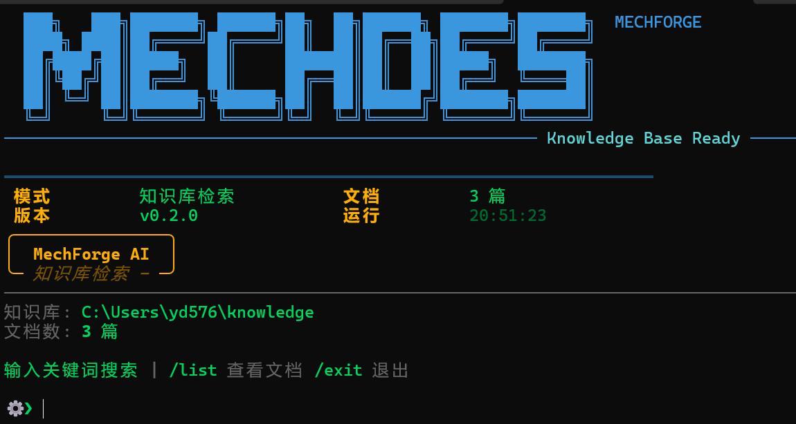

# MechForge / MechChodes

**机械设计师的本地 AI 工作台** —— 终于有一款**真正懂机械、敢说真话、能真算**的工具

## 界面预览

### AI 对话模式


### 知识库检索模式



---

## 为什么机械设计师需要 MechForge？

每天你都在和通用大模型斗智斗勇：
它一会儿胡说八道安全系数，一会儿给你云端泄露图纸跑一次有限元，一会儿又无法真正。

**MechForge 彻底解决这三个痛点**：

### 1. 绝对可信 —— 知识查阅模式"只搬书，不编故事"
- 纯检索 + 原文呈现，AI 绝不允许自由生成
- 查询 GB/JB 手册、零件参数、标准条款时，直接弹出原文 + 出处
- 工程师最怕的"幻觉"在这里被彻底封杀

### 2. 像老工程师一样聊天 —— AI 模式
- 不是一本会说话的手册，而是一位有 10+ 年经验的机械前辈
- 会问工况、提醒裕度、对比选型、指出加工风险
- 支持 /rag 临时调用知识库，聊天与查书无缝切换

### 3. 真正能干活 —— 全栈本地 AI
- 全程本地运行，无需联网，无数据泄露
- 支持 Ollama / OpenAI / Anthropic / 本地 GGUF 多种模型
- 工业科幻风 CLI 像操作真实设备

---

## 独家优势

- **模块化设计**：AI 聊天 + 知识检索独立运行，按需选择
- **全局统一赛博机械主题**：工业控制台风格
- **完全本地优先**：隐私与性能兼得
- **流式输出**：实时响应，打字机效果

---

## 快速开始

```bash
# 安装依赖
pip install -e .

# 启动 AI 对话模式
mechforge-ai
# 或
python run_main.py

# 启动知识库检索模式
mechforge-k
# 或
python run_knowledge.py
```

### 配置

编辑 `config.yaml` 或设置环境变量:

- `OPENAI_API_KEY` - OpenAI API Key
- `ANTHROPIC_API_KEY` - Anthropic API Key
- `OLLAMA_URL` - Ollama 服务地址 (默认 http://localhost:11434)
- `OLLAMA_MODEL` - Ollama 模型名称

---

## 一句话总结

**MechForge 不是又一个 ChatGPT 包装，而是机械设计圈里第一个"本地、可信、能真干活"的 AI 工作台。**

---

## 版本

当前版本: v0.3.0
